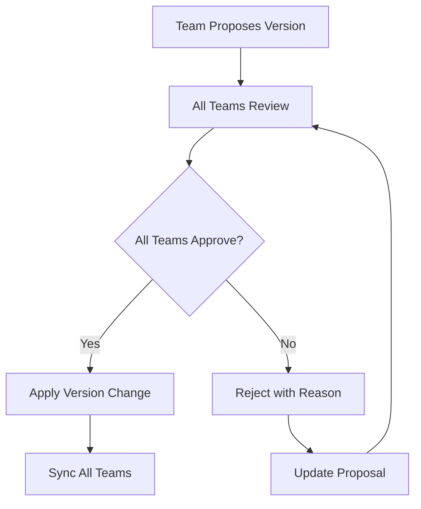

# Multi-Team Version Management Guide

## 🎯 **Overview**

Managing versions across multiple teams is one of the most challenging aspects of software development. This guide covers the common challenges, solutions, and best practices for coordinating version changes in multi-team environments.

## 🚨 **Common Multi-Team Version Challenges**

### **1. Version Conflicts**

- **Problem**: Multiple teams incrementing versions simultaneously
- **Impact**: Duplicate version numbers, deployment conflicts
- **Example**: Frontend team releases 2.1.0 while backend team also releases 2.1.0

### **2. Coordination Overhead**

- **Problem**: Manual coordination between teams for version changes
- **Impact**: Delays, miscommunication, missed dependencies
- **Example**: Waiting for all teams to approve a major version bump

### **3. Release Synchronization**

- **Problem**: Teams releasing at different times with different versions
- **Impact**: Integration issues, inconsistent user experience
- **Example**: Mobile app 2.1.0 with backend API 2.0.5

### **4. Dependency Management**

- **Problem**: Teams depending on each other's version changes
- **Impact**: Blocked releases, circular dependencies
- **Example**: Frontend needs backend API changes in 2.1.0

### **5. Rollback Complexity**

- **Problem**: Rolling back changes across multiple teams
- **Impact**: Extended downtime, data inconsistencies
- **Example**: Rolling back a feature that spans frontend, backend, and mobile

## 🛠️ **GitAT Multi-Team Version Solutions**

### **1. Centralized Version Management**

```bash
# Show current multi-team status
git @ version multi-team

# Propose a version change
git @ version multi-team propose 2.1.0 "Add new API endpoints"

# Approve a proposal
git @ version multi-team approve prop_1234567890

# Lock version during release
git @ version multi-team lock

# Sync all teams
git @ version multi-team sync
```

### **2. Approval Workflow**



### **3. Version Locking**

```bash
# Lock version for release window
git @ version multi-team lock

# Set lock duration and reason
# - 1 hour, 4 hours, 1 day, 1 week, or manual
# - Prevents version changes during critical periods
```

## 🏗️ **Implementation Strategies**

### **Strategy 1: Monorepo with Shared Versioning**

```bash
# Single repository with all team code
project/
├── frontend/
├── backend/
├── mobile/
├── shared/
└── .git/
    └── gitat-logs/
        └── version-changes.log
```

**Pros:**

- Single source of truth for versions
- Atomic commits across teams
- Simplified dependency management

**Cons:**

- Larger repository size
- Potential merge conflicts
- All teams affected by any change

### **Strategy 2: Multi-Repo with Centralized Version Registry**

```bash
# Separate repositories with shared version config
frontend-repo/
├── package.json
└── .git/

backend-repo/
├── pom.xml
└── .git/

mobile-repo/
├── build.gradle
└── .git/

version-registry/
└── versions.json
```

**Pros:**

- Team autonomy
- Smaller repositories
- Independent release cycles

**Cons:**

- Complex version synchronization
- Potential for drift
- More coordination overhead

### **Strategy 3: Hybrid Approach**

```bash
# Core services in monorepo, independent services separate
core-monorepo/
├── shared-lib/
├── auth-service/
├── user-service/
└── .git/

independent-services/
├── analytics-service/
├── notification-service/
└── reporting-service/
```

## 📋 **Best Practices**

### **1. Version Numbering Strategy**

#### **Semantic Versioning with Team Prefixes**

```
2.1.0-frontend.1    # Frontend team's first release of 2.1.0
2.1.0-backend.2     # Backend team's second release of 2.1.0
2.1.0-mobile.1      # Mobile team's first release of 2.1.0
```

#### **Coordinated Versioning**

```
2.1.0               # All teams release together
2.1.1               # All teams release together
2.2.0               # All teams release together
```

### **2. Release Coordination**

#### **Release Windows**

```bash
# Lock versions during release windows
git @ version multi-team lock

# Set release window (e.g., every Tuesday 2-4 PM)
# All teams coordinate releases during this time
```

#### **Release Phases**

```bash
# Phase 1: Backend releases first
git @ version multi-team propose 2.1.0 "Backend API changes"

# Phase 2: Frontend releases after backend
git @ version multi-team propose 2.1.0 "Frontend UI updates"

# Phase 3: Mobile releases last
git @ version multi-team propose 2.1.0 "Mobile app updates"
```

### **3. Communication Protocols**

#### **Version Change Notifications**

```bash
# Automated notifications for version proposals
git @ version multi-team propose 2.1.0 "Breaking API changes"

# Teams receive notifications and must respond within 24 hours
# Slack/Teams integration for real-time notifications
```

#### **Release Notes Coordination**

```bash
# Centralized release notes
RELEASE_NOTES_2.1.0.md:
- Backend: New user authentication API
- Frontend: Updated login interface
- Mobile: Enhanced biometric login
- DevOps: Updated deployment pipeline
```

### **4. Rollback Procedures**

#### **Coordinated Rollback**

```bash
# Emergency rollback across all teams
git @ version multi-team propose 2.0.5 "Emergency rollback - fix critical bug"

# All teams must approve within 1 hour
# Automated rollback deployment
```

#### **Partial Rollback**

```bash
# Rollback specific team only
git @ version multi-team propose 2.1.0-frontend.0 "Rollback frontend only"

# Other teams continue with current versions
```

## 🔧 **GitAT Multi-Team Commands**

### **Status and Monitoring**

```bash
# Show current multi-team status
git @ version multi-team

# Show team-specific status
git @ version multi-team teams

# Show version history
git @ version multi-team history
```

### **Version Proposals**

```bash
# Create a version proposal
git @ version multi-team propose 2.1.0 "Add new payment API"

# Approve a proposal
git @ version multi-team approve prop_1234567890

# Reject a proposal with reason
git @ version multi-team reject prop_1234567890 "API not ready yet"
```

### **Version Locking**

```bash
# Lock version during release
git @ version multi-team lock

# Unlock version (only by locking team)
git @ version multi-team unlock

# Force unlock (emergency override)
git @ version multi-team unlock --force
```

### **Synchronization**

```bash
# Sync all teams to latest version
git @ version multi-team sync

# Sync specific team
git @ version multi-team sync --team frontend

# Dry run sync (preview changes)
git @ version multi-team sync --dry-run
```

## 📊 **Team Configuration**

### **Setting Team Identity**

```bash
# Set your team
git config at.team frontend

# Available teams
# - frontend
# - backend
# - mobile
# - devops
# - qa
# - design
# - product
```

### **Team Permissions**

```bash
# Team-specific permissions
frontend: Can propose, approve, reject
backend: Can propose, approve, reject
mobile: Can propose, approve, reject
devops: Can lock/unlock, force sync
qa: Can approve, reject
```

## 🚀 **Advanced Features**

### **1. Automated Version Bumping**

```bash
# Auto-bump based on commit types
git @ version multi-team auto-bump

# Rules:
# - feat: minor version bump
# - fix: patch version bump
# - breaking: major version bump
```

### **2. Dependency Tracking**

```bash
# Track dependencies between teams
git @ version multi-team deps

# Shows:
# - Frontend depends on Backend 2.1.0
# - Mobile depends on Backend 2.1.0
# - DevOps depends on all teams
```

### **3. Release Pipeline Integration**

```bash
# CI/CD integration
git @ version multi-team ci-check

# Validates:
# - All teams have approved
# - No version conflicts
# - Dependencies are satisfied
```

## 📈 **Metrics and Monitoring**

### **Version Health Metrics**

```bash
# Version drift analysis
git @ version multi-team drift

# Shows:
# - Teams with outdated versions
# - Time since last sync
# - Version conflict warnings
```

### **Release Velocity**

```bash
# Release frequency analysis
git @ version multi-team velocity

# Shows:
# - Releases per team per month
# - Average time to approval
# - Bottleneck identification
```

## 🔒 **Security and Compliance**

### **Audit Trail**

```bash
# All version changes are logged
.git/gitat-logs/version-changes.log

# Format:
# [2024-01-15 14:30:00] Version proposal prop_123: 2.0.5 -> 2.1.0 by frontend
# [2024-01-15 15:45:00] Version approved by backend
# [2024-01-15 16:00:00] Version applied: 2.1.0
```

### **Access Control**

```bash
# Role-based access control
git @ version multi-team roles

# Roles:
# - Version Manager: Can lock/unlock, force sync
# - Team Lead: Can propose, approve, reject
# - Developer: Can propose only
# - Observer: Read-only access
```

## 🎯 **Implementation Roadmap**

### **Phase 1: Foundation (Week 1-2)**

- [ ] Set up team configurations
- [ ] Implement basic version proposal workflow
- [ ] Create approval system
- [ ] Set up logging and audit trail

### **Phase 2: Automation (Week 3-4)**

- [ ] Implement automated notifications
- [ ] Add CI/CD integration
- [ ] Create dependency tracking
- [ ] Build monitoring dashboards

### **Phase 3: Advanced Features (Week 5-6)**

- [ ] Add rollback procedures
- [ ] Implement emergency override
- [ ] Create release pipeline integration
- [ ] Add metrics and analytics

### **Phase 4: Optimization (Week 7-8)**

- [ ] Performance optimization
- [ ] User experience improvements
- [ ] Documentation and training
- [ ] Feedback and iteration

## 📚 **Additional Resources**

- [Semantic Versioning Specification](https://semver.org/)
- [Git Flow Workflow](https://nvie.com/posts/a-successful-git-branching-model/)
- [Trunk-Based Development](https://trunkbaseddevelopment.com/)
- [Release Management Best Practices](https://www.atlassian.com/agile/software-development/release-management)

---

**Multi-team version management requires careful coordination, clear communication, and robust tooling. GitAT provides the foundation for successful multi-team version coordination while maintaining team autonomy and ensuring release quality.**
